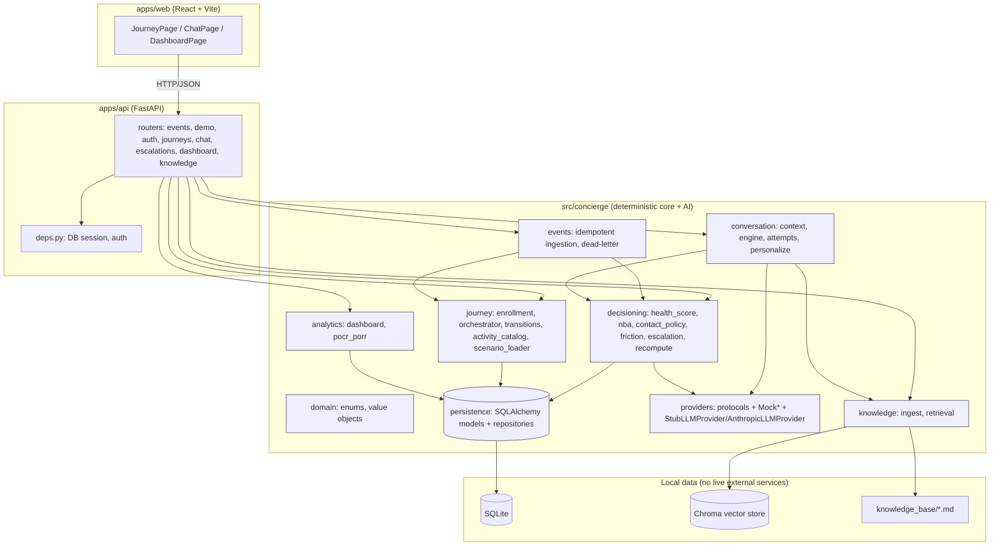

# Architecture

30-Day Personalized AI Concierge is a modular monolith (Constitution Principle IX): one FastAPI process (`apps/api`) importing a pure Python package (`src/concierge/*`) in-process, plus one React/Vite SPA (`apps/web`). No network hop between modules; no microservices.

## Module Diagram

## Design invariants (Constitution)

- **Deterministic before AI (Principle I)**: `decisioning/*` and `journey/*` never call an LLM. The only LLM touchpoints are `conversation/engine.py` (personalizes/explains already-finalized decisions) and `conversation/personalize.py` (adds wording to an already-persisted `NextBestActionRecord`) — both strictly downstream of deterministic computation.
- **Mock-first (Principle II)**: every external dependency goes through a `Protocol` in `providers/protocols.py`, with a deterministic seeded mock as the default wiring. `StubLLMProvider` requires no API key; `AnthropicLLMProvider` only activates when `ANTHROPIC_API_KEY` is set.
- **Privacy boundary (Principle IV)**: every customer-specific route (`journeys/*`, `escalations`, and the authenticated half of `chat`) is protected by `apps/api/deps.py`'s `get_current_customer` + `journey_access.py`'s ownership check (401/403).
- **Explainability (Principle V)**: `HealthScoreRecord`/`NextBestActionRecord` always carry `reason_codes`.
- **Idempotent + auditable (Principle VI)**: `events/ingestion.py` dedupes by `event_id`; every activity/health/NBA change writes a `StateTransitionLog` row.
- **Simple architecture (Principle IX)**: one deployable API process, one SPA — see above.
- **Labeled simulated metrics (Principle X)**: `GET /api/dashboard` always returns `simulated: true` and a disclaimer `label`.

## Verified

Every backend capability, including billing/renewal (`MockBillingProvider`, `GET /journeys/{id}/billing`), is implemented and covered by the 257 passing `pytest` tests. The React demo UI (`apps/web`) has been run end-to-end against the live API — scenario load, journey/health/NBA rendering, chat + escalation, and billing/renewal all confirmed working in-browser — with its 9 Vitest component tests passing. `BillingCard` handles a 404 gracefully (e.g. a scenario with no billing/renewal fixture seeded, such as a line still stuck on activation failure) rather than fabricating figures.
