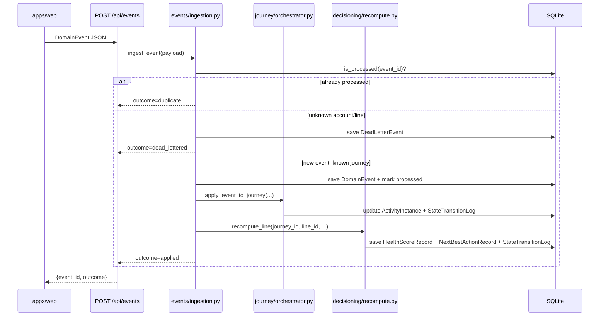
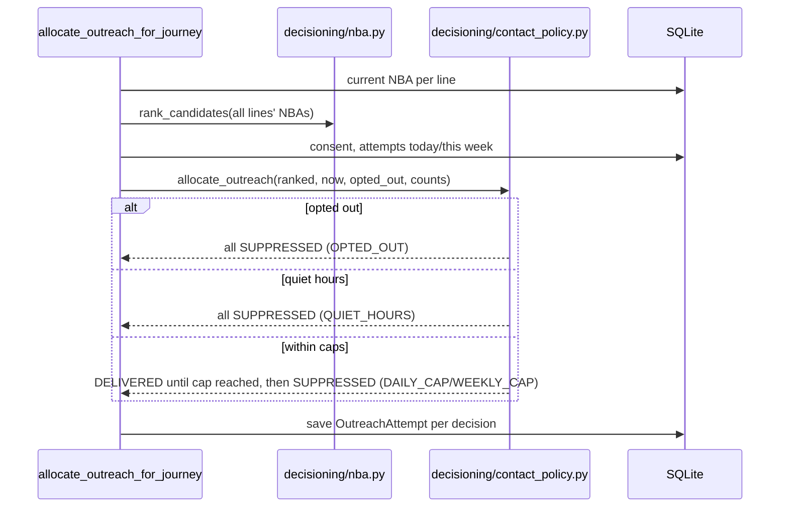
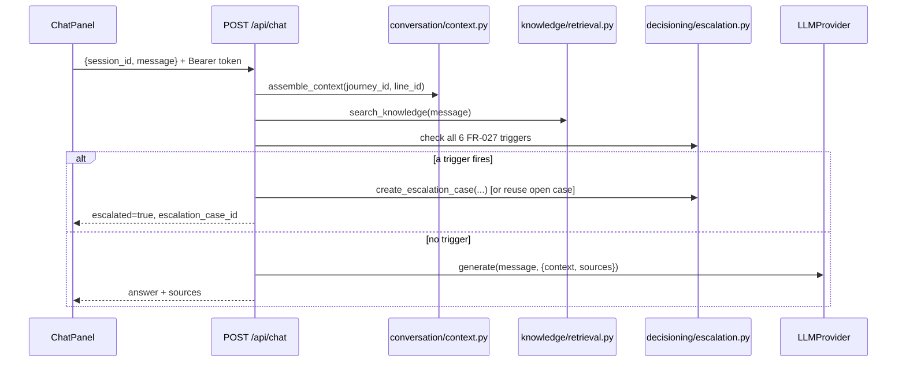
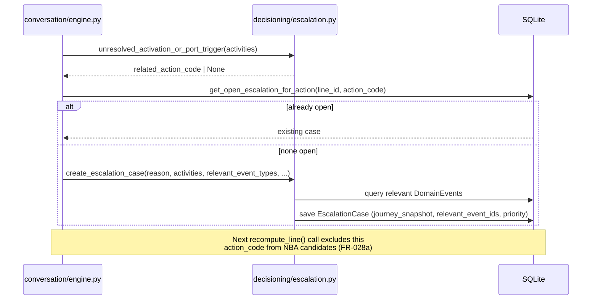

# Sequence Diagrams

## 1. Event ingestion → health/NBA recompute

```mermaid
sequenceDiagram
    participant UI as apps/web
    participant API as POST /api/events
    participant Ing as events/ingestion.py
    participant Orch as journey/orchestrator.py
    participant Rec as decisioning/recompute.py
    participant DB as SQLite

    UI->>API: DomainEvent JSON
    API->>Ing: ingest_event(payload)
    Ing->>DB: is_processed(event_id)?
    alt already processed
        Ing-->>API: outcome=duplicate
    else unknown account/line
        Ing->>DB: save DeadLetterEvent
        Ing-->>API: outcome=dead_lettered
    else new event, known journey
        Ing->>DB: save DomainEvent + mark processed
        Ing->>Orch: apply_event_to_journey(...)
        Orch->>DB: update ActivityInstance + StateTransitionLog
        Ing->>Rec: recompute_line(journey_id, line_id, ...)
        Rec->>DB: save HealthScoreRecord + NextBestActionRecord + StateTransitionLog
        Ing-->>API: outcome=applied
    end
    API-->>UI: {event_id, outcome}
```

## 2. Proactive outreach decision

```mermaid
sequenceDiagram
    participant Caller as allocate_outreach_for_journey
    participant NBA as decisioning/nba.py
    participant Policy as decisioning/contact_policy.py
    participant DB as SQLite

    Caller->>DB: current NBA per line
    Caller->>NBA: rank_candidates(all lines' NBAs)
    Caller->>DB: consent, attempts today/this week
    Caller->>Policy: allocate_outreach(ranked, now, opted_out, counts)
    alt opted out
        Policy-->>Caller: all SUPPRESSED (OPTED_OUT)
    else quiet hours
        Policy-->>Caller: all SUPPRESSED (QUIET_HOURS)
    else within caps
        Policy-->>Caller: DELIVERED until cap reached, then SUPPRESSED (DAILY_CAP/WEEKLY_CAP)
    end
    Caller->>DB: save OutreachAttempt per decision
```

## 3. Chat + RAG (authenticated)

```mermaid
sequenceDiagram
    participant UI as ChatPanel
    participant API as POST /api/chat
    participant Ctx as conversation/context.py
    participant KB as knowledge/retrieval.py
    participant Esc as decisioning/escalation.py
    participant LLM as LLMProvider

    UI->>API: {session_id, message} + Bearer token
    API->>Ctx: assemble_context(journey_id, line_id)
    API->>KB: search_knowledge(message)
    API->>Esc: check all 6 FR-027 triggers
    alt a trigger fires
        API->>Esc: create_escalation_case(...) [or reuse open case]
        API-->>UI: escalated=true, escalation_case_id
    else no trigger
        API->>LLM: generate(message, {context, sources})
        API-->>UI: answer + sources
    end
```

## 4. Escalation creation

```mermaid
sequenceDiagram
    participant Engine as conversation/engine.py
    participant Esc as decisioning/escalation.py
    participant DB as SQLite

    Engine->>Esc: unresolved_activation_or_port_trigger(activities)
    Esc-->>Engine: related_action_code | None
    Engine->>DB: get_open_escalation_for_action(line_id, action_code)
    alt already open
        DB-->>Engine: existing case
    else none open
        Engine->>Esc: create_escalation_case(reason, activities, relevant_event_types, ...)
        Esc->>DB: query relevant DomainEvents
        Esc->>DB: save EscalationCase (journey_snapshot, relevant_event_ids, priority)
    end
    Note over Engine,DB: Next recompute_line() call excludes this<br/>action_code from NBA candidates (FR-028a)
```
